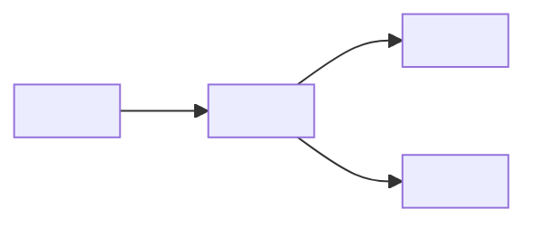

# ecli

Erynoa CLI — self-contained install and update stack.

Seeded 2026-09-18 (`a9d9ac6`); the work-root [`docs/work/ROADMAP.md`](docs/work/ROADMAP.md) landed via PR #1. Product scope is not defined yet — open questions in [`erynoa.md`](erynoa.md).

<!-- ERYNOA-MODEL:BEGIN -->
## Model

> Default system sketch (**SE-04** C4-lite). Depth: [`docs/`](./docs/README.md) · agents: [`erynoa.md`](./erynoa.md).

| Part | Role |
|------|------|
| `<App>` | Primary runtime / CLI / service |
| `<Data>` | Config, state, or backing store |
| `<Ext>` | External APIs / hosts (if any) |

*Replace labels with real modules from the tree. Keep this block ≤ ~25 lines.*
<!-- ERYNOA-MODEL:END -->
