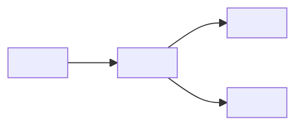

# ecli

Erynoa CLI — self-contained install and update stack.

Seed commit only: repository was empty (created 2026-09-17), so no default tip existed and a ROADMAP pull request could not open. Product scope is not defined in this file. Next: scaffold `docs/work/ROADMAP.md` via PR.

<!-- ERYNOA-MODEL:BEGIN -->
## Model

> Default system sketch (**SE-04** C4-lite). Depth: [`docs/`](./docs/README.md) · agents: [`erynoa.md`](./erynoa.md).

| Part | Role |
|------|------|
| `<App>` | Primary runtime / CLI / service |
| `<Data>` | Config, state, or backing store |
| `<Ext>` | External APIs / hosts (if any) |

*Replace labels with real modules from the tree. Keep this block ≤ ~25 lines.*
<!-- ERYNOA-MODEL:END -->
